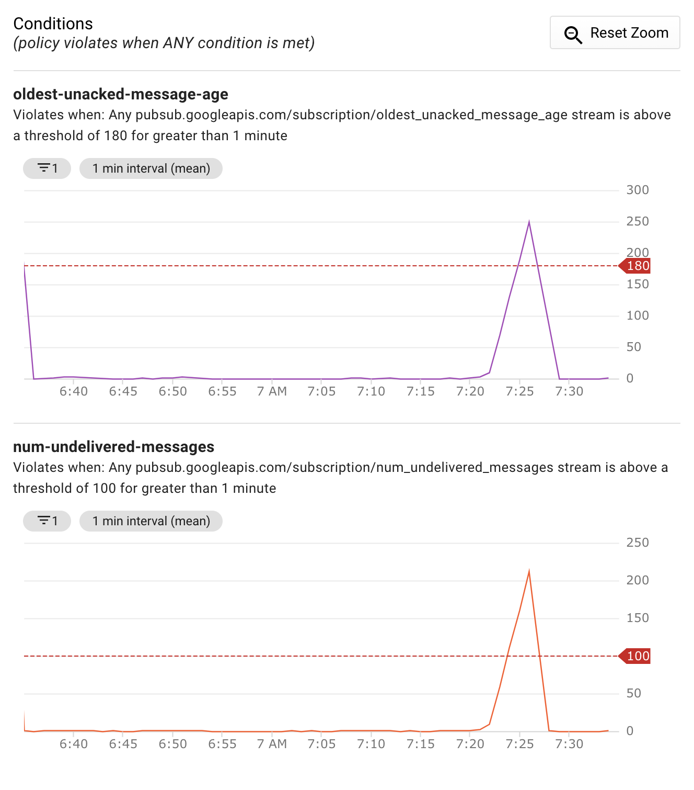

# Drain PubSub topic messages to BigQuery table

Simple utility combining Cloud Run and Stackdriver metrics to drain JSON messages from PubSub topic into BigQuery table


## Prerequisites

If you don't have one already, start by creating new project and configuring [Google Cloud SDK](https://cloud.google.com/sdk/docs/). Similarly, if you have not done so already, you will have [set up Cloud Run](https://cloud.google.com/run/docs/setup).

## How to Use It

The quick way to deploy includes:

* Editing [bin/config](bin/config) file
* Executing [bin/install](bin/install) script

### Configuration

The [bin/config](bin/config) file includes many parameters but the only ones you have to change are:

* `TOPIC_NAME` - this is the name of the PubSub topic from which you want to drain messages into BigQuery
* `DATASET_NAME` - name of the existing BigQuery dataset in your project
* `TABLE_NAME` - name of the existing BigQuery table that resides in above defined dataset

> Note, this service assumes your BigQuery table schema matches the names of JSON message fields. Column names are not case sensitive and JSON fields not present in the table will be ignored. You can use [this service](https://bigquery-json-schema-generator.com/) to generate BigQuery schema from a single JSON message of your PubSub queue

This service also creates two `trigger metrics` on the topic to decide when to batch insert messages into BigQuery table. These are age of the oldest unacknowledged message (`TOPIC_MAX_MESSAGE_AGE`) or maximum number of still undelivered messages (`TOPIC_MAX_MESSAGE_COUNT`). There is some delay but basically as soon as one of these thresholds is reached, the service will be triggered.



Additional parameters are set to resealable defaults, change them as needed. I've provided comments for each to help you set this to optimal value for your use-case.


## Why Custom Service

Google Cloud has an easy approach to draining your PubSub messages into BigQuery. Using provided template you create a job that will consistently and reliably stream your messages into BigQuery.

```shell
gcloud dataflow jobs run $JOB_NAME --region us-west1 \
  --gcs-location gs://dataflow-templates/latest/PubSub_to_BigQuery \
  --parameters "inputTopic=projects/${PROJECT}/topics/${TOPIC},outputTableSpec=${PROJECT}:${DATASET}.${TABLE}"
```

This approach solves many of the common issues related to back pressure, retries, and individual insert quota limits. If you are either dealing with a constant stream of messages or need to drain your PubSub messages immediately into BigQuery, this is your best option.

The one downside of that approach is that, behind the scene, Dataflow deploys VMs. While the machine types and the number of VMs are configurable, there will always be at least one VM. That means that, whether there are messages to process or not, you always pay for VMs.

However, if your message flow is in-frequent or don't mind messages being written in scheduled batches, you can avoid that cost by using this service.


## Building Image

The service uses pre-build image from a public image repository [gcr.io/cloudylabs-public/pubsub-to-bigquery-pump](gcr.io/cloudylabs-public/pubsub-to-bigquery-pump). If you prefer to build your own image you can submit a job to the Cloud Build service using the included [Dockerfile](./Dockerfile) and results in versioned, non-root container image URI which will be used to deploy your service to Cloud Run.

```shell
bin/image
```

## Cleanup

To cleanup all resources created by this sample execute

```shell
bin/cleanup
```

## Disclaimer

This is my personal project and it does not represent my employer. I take no responsibility for issues caused by this code. I do my best to ensure that everything works, but if something goes wrong, my apologies is all you will get.


